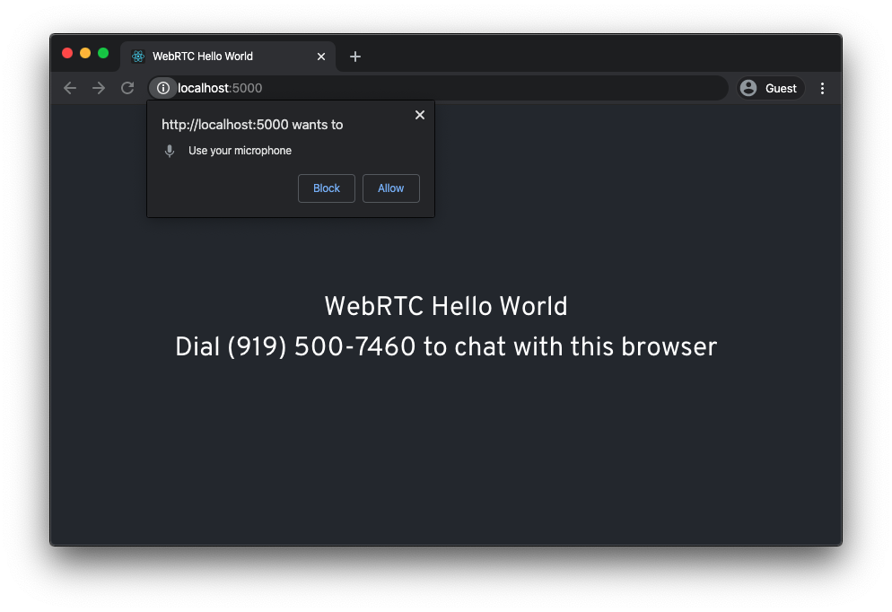

# WebRTC Hello World

This sample app shows the simplest way to get a phone to talk to a browser through Bandwidth's WebRTC and Voice APIs.

## Architecture Overview


This app runs an HTTP server that listens for requests from browsers to get connection information. This connection information tells a browser the unique ID it should use to join a WebRTC conference. The HTTP server will also handle requests coming from Bandwidth's Voice API when a phone call comes in.

The server also connects a websocket to Bandwidth's WebRTC API, which it will use to create a conference and participant IDs. This websocket is managed by the WebRTC SDK.

The web browser will also use a websocket managed by the WebRTC browser SDK to handle signaling to the WebRTC API. Once both a browser and a phone have joined the conference, they will be able to talk to each other.

> Note: This is a very simplistic demo and it is not designed to handle multiple browsers or multiple phones. For that use case, please see the [Conference Demo](https://github.com/Bandwidth/webrtc-sample-conference-node).<br/>Also, please note: Unless you are running on `localhost`, you will need to use HTTPS. Most modern browsers require a secure context when accessing cameras and microphones.

## Setting things up

To run this sample, you'll need a Bandwidth phone number, Voice API credentials and WebRTC enabled for your account. Please check with your account manager to ensure you are provisioned for WebRTC.

This sample will need be publicly accessible to the internet in order for Bandwidth API callbacks to work properly. Otherwise you'll need a tool like [ngrok](https://ngrok.com) to provide access from Bandwidth API callbacks to localhost.

### Create a Bandwidth Voice API application

Follow the steps in [How to Create a Voice API Application](https://support.bandwidth.com/hc/en-us/articles/360035060934-How-to-Create-a-Voice-API-Application-V2-) to create your Voice API appliation.

In step 7 and 8, make sure they are set to POST.

In step 9, provide the publicly accessible URL of your sample app. You need to add `/callback` to the end of this URL in the Voice Application settings.

You do no need to set a callback user id or password.

Create the application and make note of your _Application ID_. You will provide this in the settings below.

### Configure your sample app

Copy the default configuration files

```bash
cp .env.default .env
```

Add your Bandwidth account settings to `.env`:

- ACCOUNT_ID
- USERNAME
- PASSWORD

Add your Voice Application settings to `.env`:

- VOICE_NUMBER (Bandwith phone number associated with the Voice Application in [E.164 format](https://www.bandwidth.com/glossary/e164/))
- VOICE_APP_ID (the Voice Application ID from above)
- VOICE_CALLBACK_URL (the publicly accessible URL you specified as the callback in the Voice Application. It should have `/callback` at the end of the URL)

You can also customize the phone number that is displayed in the frontend by modifying the `frontend/.env` file:

- `REACT_APP_PHONE_NUMBER` (display string for the dial in phone number)

### Install dependencies and build

```bash
npm install
npm start
```

### Communicate!

Browse to [http://localhost:5000](http://localhost:5000) and you should see the following screen:



After granting permission to use your microphone, you should now be able to dial your phone number, and start chatting. The web UI will indicate when you are connected.

Enjoy!
